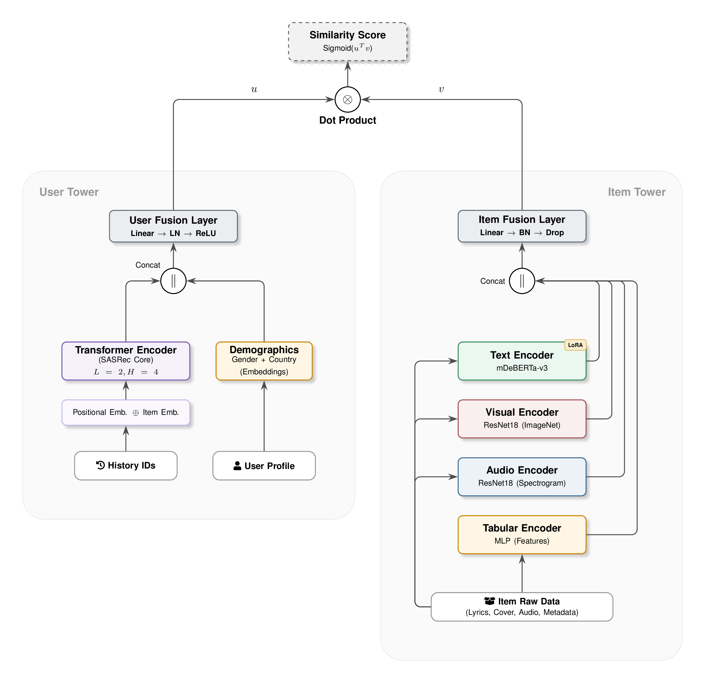

# 🎵 Arquitectura Híbrida Two-Tower para Recomendación Musical Multimodal


---

## 📖 Descripción General

Este proyecto implementa un sistema de recomendación musical del Estado del Arte (SOTA) utilizando una arquitectura **Two-Tower** con fusión **Cross-Modal**. El objetivo es resolver los problemas de escasez de datos (*sparsity*) y brecha semántica (*semantic gap*) en los sistemas tradicionales.

El modelo alinea dos espacios vectoriales:
1.  **User Tower:** Codifica la secuencia histórica de interacciones del usuario usando **SASRec** (Transformer secuencial).
2.  **Item Tower:** Codifica el contenido de la canción mediante **Atención Cruzada (Cross-Attention)** entre Audio (Mel-Spectrograms), Texto (Lyrics) e Imagen (Carátulas).

## 🏗️ Arquitectura del Sistema



El sistema se basa en una arquitectura **Two-Tower** que aprende representaciones vectoriales (embeddings) tanto para usuarios como para ítems en un espacio métrico compartido.

### 1. User Tower (Secuencial)
- **Entrada:** Secuencia histórica de interacciones del usuario (IDs de canciones).
- **Modelo:** **SASRec** (Self-Attention Sequential Recommendation).
- **Funcionamiento:** Utiliza mecanismos de auto-atención para capturar dependencias a largo y corto plazo en las preferencias del usuario.

### 2. Item Tower (Multimodal)
- **Entrada:** Audio, Texto (Letras) e Imágenes (Carátulas).
- **Codificadores:**
    - **Audio:** ResNet-18 procesando Mel-Spectrograms.
    - **Texto:** mDeBERTa (con adaptadores LoRA) para procesar letras multilingües.
    - **Imagen:** ResNet-18 pre-entrenada en ImageNet.
- **Fusión:** Mecanismo de **Cross-Attention** que permite a las modalidades interactuar y ponderar su importancia dinámicamente.

### 3. Entrenamiento
- **Función de Pérdida:** **InfoNCE** (Contrastive Loss).
- **Objetivo:** Maximizar la similitud entre el embedding del usuario y el embedding del siguiente ítem positivo, mientras se minimiza la similitud con ítems negativos (in-batch negatives).

Este proyecto utiliza **`uv`** para la gestión de dependencias y **DVC** para el control de versiones de datos.

### Prerrequisitos

  * Python 3.9+
  * [uv](https://github.com/astral-sh/uv) instalado.
  * `ffmpeg` instalado en el sistema (para procesamiento de audio).

### 1\. Clonar el repositorio

```bash
git clone <url-del-repositorio>
cd proyecto-mir
```

### 2\. Instalar dependencias

```bash
uv sync
# Esto creará el entorno virtual e instalará todo lo necesario
```

### 3. Configurar Datos (DVC)

⚠️ **Aviso de Privacidad y Copyright:**
El dataset completo **no es de acceso público**. Los archivos `.dvc` en este repositorio son solo metadatos (punteros). El almacenamiento remoto está restringido.

Para reproducir los experimentos, es necesario solicitar acceso a los autores. Si eres un colaborador autorizado, configura tus credenciales de Google Drive:

```bash
# Configurar credenciales locales (no se suben al repo, se adjuntan en el trabajo)
dvc remote modify --local proyecto_multimodal gdrive_client_id "<gdrive_client_id>"
dvc remote modify --local proyecto_multimodal gdrive_client_secret "<gdrive_client_secret>"

# Descargar datos
uv run dvc pull
```

**Nota:** En el futuro, se publicará una versión del dataset libre de derechos que incluirá únicamente los embeddings pre-calculados y features extraídos.

### 4. Variables de Entorno

Asegúrate de tener configuradas las variables necesarias, especialmente si usas modelos de HuggingFace que requieran token (aunque mDeBERTa es público).

```bash
export HF_HOME="./.cache/huggingface"
```

-----

## 🏋️‍♂️ Entrenamiento

Para entrenar el modelo desde cero hemos utilizado el clúster del CIMAT (Bajío), el cual cuenta con 2 GPUs en cada nodo. El funcionamiento puede variar dependiendo del hardware donde se quiera reproducir el entrenamiento (Los requerimientos de Hardware son altos, un tamaño de lote de 64 requiere mas de 24 GB VRAM).

En todo caso, utilizamos el script `src/train.py`. Este script se encarga de:
1. Cargar y preprocesar los datos.
2. Ajustar y guardar los encoders (necesarios para inferencia).
3. Entrenar el modelo Two-Tower.

```bash
# Agregar el directorio actual al PYTHONPATH para que Python encuentre el módulo 'src'
export PYTHONPATH=$PWD

# Para el clúster CIMAT utilizamos el script train.sh
uv run python -m torch.distributed.run --nproc_per_node=1 src/train.py \
    --data_path "data/spotify-kaggle/interim/lastfm_spotify_merged.csv" \
    --img_dir "data/spotify-kaggle/album_covers/" \
    --audio_dir "data/audio/mels/" \
    --lyrics_path "data/spotify-kaggle/interim/lyrics_dataset_10k_fixed.csv" \
    --epochs 10 \
    --batch_size 32

# En local (considerando una GPU).
uv run python -m torch.distributed.run --nproc_per_node=1 src/train.py \
    --data_path "data/spotify-kaggle/interim/lastfm_spotify_merged.csv" \
    --img_dir "data/spotify-kaggle/album_covers/" \
    --audio_dir "data/audio/mels/" \
    --lyrics_path "data/spotify-kaggle/interim/lyrics_dataset_10k_fixed.csv" \
    --epochs 10 \
    --batch_size 32
```

**Nota:** Los checkpoints y encoders se guardarán automáticamente en la carpeta `checkpoints/`.

-----

## 📊 Evaluación

Para evaluar el rendimiento del modelo (Recall@K, NDCG@K) sobre el conjunto de validación/test:

```bash
uv run python src/evaluate_metrics.py \
  --model_path "checkpoints/complete/best_model_epoch1.pth" \
  --encoders_path "checkpoints/complete/encoders.pkl" \
  --data_path "data/spotify-kaggle/interim/lastfm_spotify_merged.csv" \
  --embeddings_cache_path "checkpoints/complete/item_embeddings_cache_epoch1.pt" \
  --batch_size 32
```

-----

## 🔮 Inferencia y Recomendación

El sistema de inferencia tiene dos modos: **Indexación** y **Recomendación**.

### Paso 1: Indexación (`index`)
Pre-calcula los embeddings de todas las canciones del catálogo para una búsqueda rápida.

```bash
uv run python -m src.inference \
  --mode index \
  --data_path "data/spotify-kaggle/interim/lastfm_spotify_merged.csv" \
  --mapper_path "data/spotify-kaggle/interim/item_id_mapper.json" \
  --model_path "checkpoints/complete/best_model_epoch1.pth" \
  --encoders_path "checkpoints/complete/encoders.pkl" \
  --index_path "checkpoints/complete/item_index_epoch1.pt"
```

### Paso 2: Recomendación (`recommend`)
Genera recomendaciones personalizadas para un usuario específico basándose en su historial.

```bash
uv run python -m src.inference \
  --mode recommend \
  --user_id "user_000232" \
  --data_path "data/spotify-kaggle/interim/lastfm_spotify_merged.csv" \
  --mapper_path "data/spotify-kaggle/interim/item_id_mapper.json" \
  --model_path "checkpoints/complete/best_model_epoch1.pth" \
  --encoders_path "checkpoints/complete/encoders.pkl" \
  --index_path "checkpoints/complete/item_index_epoch1.pt"
```

-----

## 📂 Estructura del Proyecto

```
.
├── checkpoints/        # Punteros DVC (.dvc) a modelos y encoders
├── notebooks/          # Jupyter Notebooks para EDA y prototipado
├── report/             # Código fuente LaTeX del reporte técnico
│   ├── chapters/       # Capítulos del reporte
│   └── images/         # Figuras y diagramas
├── src/                # Código fuente del sistema
│   ├── data/           # Scripts de descarga y procesamiento
│   ├── models/         # Arquitecturas (TwoTower, Encoders)
│   ├── scripts/        # Scripts de utilidad (check embeddings, download)
│   ├── utils/          # Funciones auxiliares (monitor, stats)
│   ├── dataset.py      # Clase MultimodalDataset
│   ├── evaluate_metrics.py
│   ├── inference.py
│   └── train.py
├── data.dvc            # Puntero DVC al dataset (audio, imágenes, metadatos)
├── logs.dvc            # Puntero DVC a los logs de ejecución
├── papers.dvc          # Puntero DVC a referencias bibliográficas
├── LICENSE
├── README.md
├── pyproject.toml      # Configuración de dependencias (uv)
└── uv.lock
```

-----

## 🤝 Flujo de Trabajo Colaborativo

Este proyecto sigue las mejores prácticas de MLOps para garantizar la reproducibilidad y la colaboración efectiva:

- **Código:** Control de versiones con **Git** y **GitHub**.
- **Datos:** Versionado de grandes volúmenes de datos (audio, imágenes) con **DVC** (Data Version Control) y almacenamiento remoto en Google Drive.
- **Dependencias:** Gestión determinista de paquetes con **`uv`**.
- **Experimentación:** Registro de métricas y modelos (checkpoints).

-----

## 👥 Equipo y Roles

Este proyecto fue desarrollado como parte del programa de Maestría en Cómputo Estadístico en el **Centro de Investigación en Matemáticas (CIMAT)**, Unidad Monterrey.

*   **César Aguirre-Calzadilla** - [cesar.aguirre@cimat.mx](mailto:cesar.aguirre@cimat.mx)
*   **Gustavo Hernández-Angeles** - [gustavo.hernandez@cimat.mx](mailto:gustavo.hernandez@cimat.mx)
*   **Diego Paniagua-Molina** - [diego.paniagua@cimat.mx](mailto:diego.paniagua@cimat.mx)

## 📜 Licencia

Este proyecto está bajo la Licencia **MIT**. Consulta el archivo `LICENSE` para más detalles.

El reporte y contenido académico se distribuye bajo la licencia **Creative Commons Attribution 4.0 International (CC BY 4.0)**.


